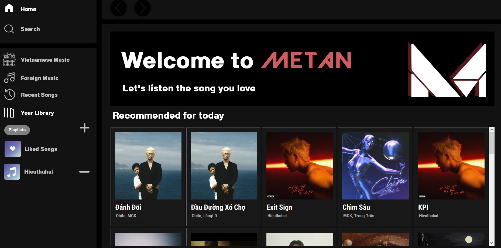

# 🎶 METAN - Music App
## 🎵 About METAN
Welcome to **METAN** - a sleek and modern music streaming application designed to offer you an immersive music experience. Whether you're looking to discover new tracks or enjoy your favorite playlists, METAN has you covered with a user-friendly interface and a wide array of features..
## 🌟 Features
- **Music Library**: Access a vast library of songs across different genres and artists. Easily search for your favorite tracks or explore new music with curated playlists.
- **Playlists**: Create, edit, and manage your personal playlists. Save your favorite songs and organize them into collections that suit your mood and activities.
- **Recent List**: Store the songs you've just listened to.
- **Favorite List**: Store the songs you like.
- **High-Quality Audio**: Enjoy crystal-clear sound with support for high-quality audio streaming, giving you the best listening experience possible.
## 🌏 Languages 
- Currently support 1 language: __English__ .
## 🚀 Getting Started
Ready to use METAN? Follow these steps to get started:
1. Create a folder named 'C#' in your computer's C drive. (Required)
2. Clone this project.
4. Run file `BTTH02.exe` in path `C:\C#\Spotify\BTTH02\bin\Debug\net8.0-windows` and enjoy the app. ✔️
## ⚠️ Important Notice
- This app doesn't have any __login and registration functionality__ like my other projects.
- Since I use json files to manage data (which I really shouldn't do), the path needs to be exactly as I mentioned in the __🚀 Getting Started__ section above.
- When you want to add a song to __Playlist__, remember to enter exactly the name of playlist that you want to add.
## 🛠️ Technologies Used
- In this project, I use __C#__ and __Winform__ for development, I have created json files to store and manage data.
## 👀 Demo

